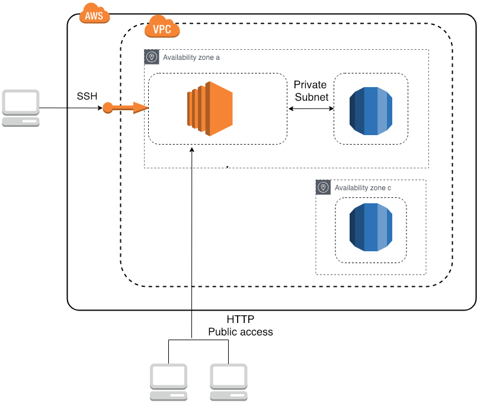

# Deployment Rails App on AWS



このレポジトリはAWS入門した個人用の記録です。
個人的に詰まったポイントを主に書き留めます。

## 構成

AWS EC2(アプリケーションデプロイサーバー) + RDS MySQL(アプリケーション用DB)
無料枠のため、複数構成で障害に備えていない。


## 参考

【AWS 再入門】EC2 + RDS によるミニマム構成なサーバー環境を構築してみよう[https://tech.recruit-mp.co.jp/infrastructure/retry-aws-minimum-vpc-server-environment/](https://tech.recruit-mp.co.jp/infrastructure/retry-aws-minimum-vpc-server-environment/)

チュートリアル: ウェブサーバーと Amazon RDS データベースの作成[https://docs.aws.amazon.com/ja_jp/AmazonRDS/latest/UserGuide/TUT_WebAppWithRDS.html](https://docs.aws.amazon.com/ja_jp/AmazonRDS/latest/UserGuide/TUT_WebAppWithRDS.html)
## 詰まった点

### pem ファイルを使ってSSH接続したらエラーが出た

ダウンロードした状態だとPermissionsの設定が0644になっていると思われるので、pemファイルのあるディレクトリにて```chmod 0400 *.pem```でPermissionsを変更してからログインする。

エラー: Unprotected Private Key File (保護されていないプライベートキーファイル)
[https://docs.aws.amazon.com/ja_jp/AWSEC2/latest/UserGuide/TroubleshootingInstancesConnecting.html#troubleshoot-unprotected-key](https://docs.aws.amazon.com/ja_jp/AWSEC2/latest/UserGuide/TroubleshootingInstancesConnecting.html#troubleshoot-unprotected-key)